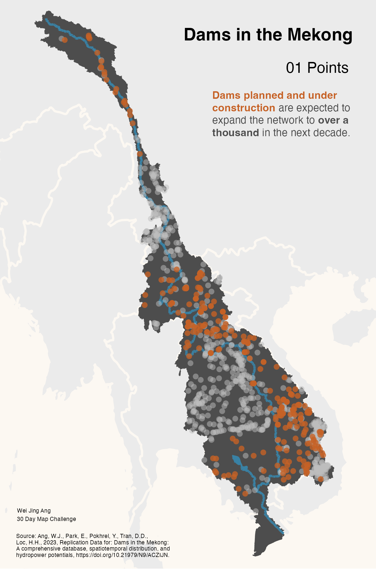
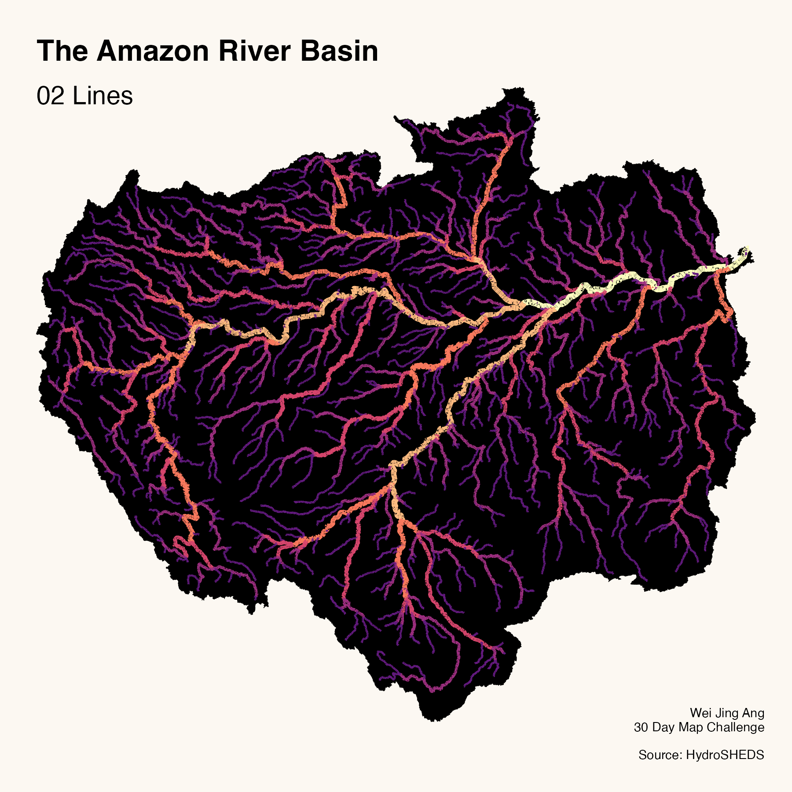
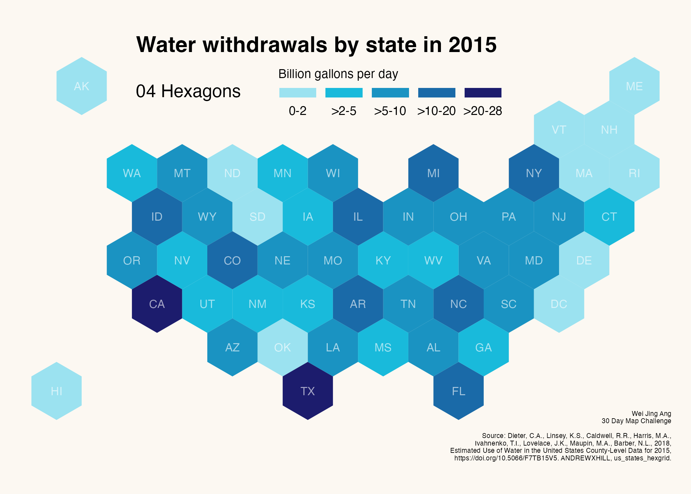
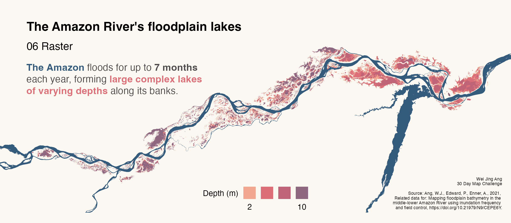
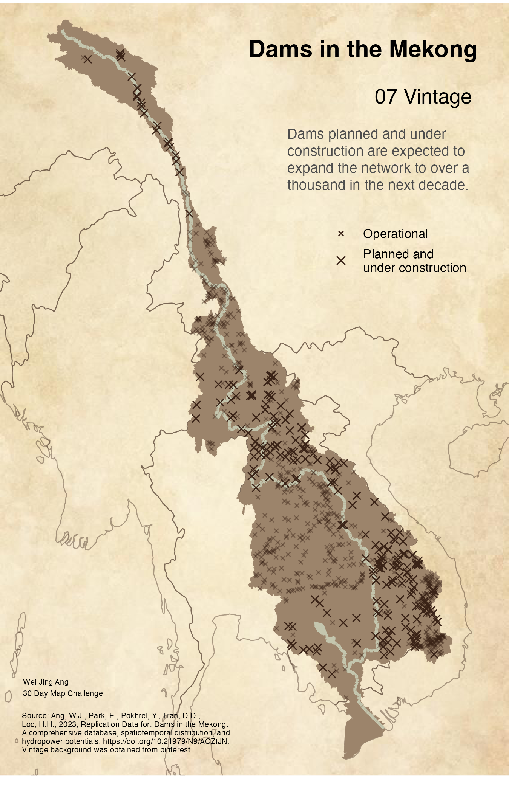
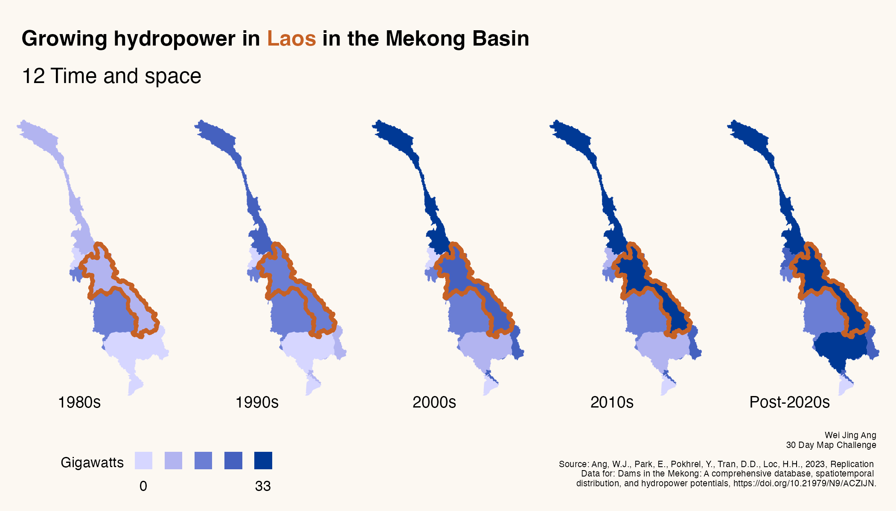
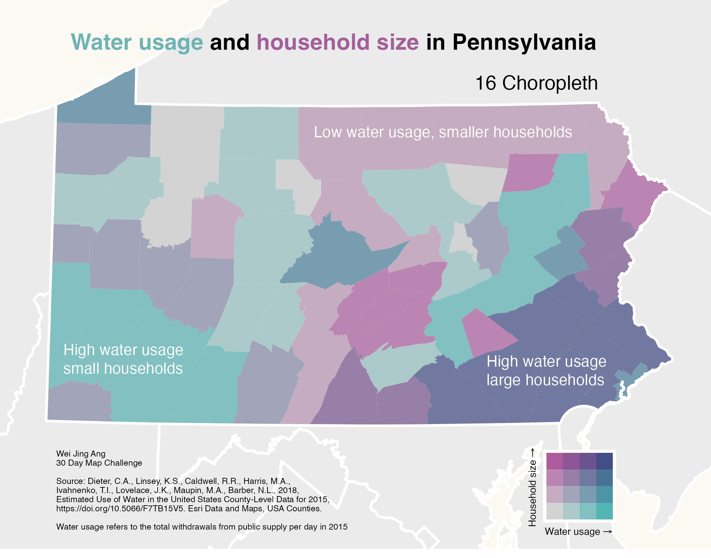
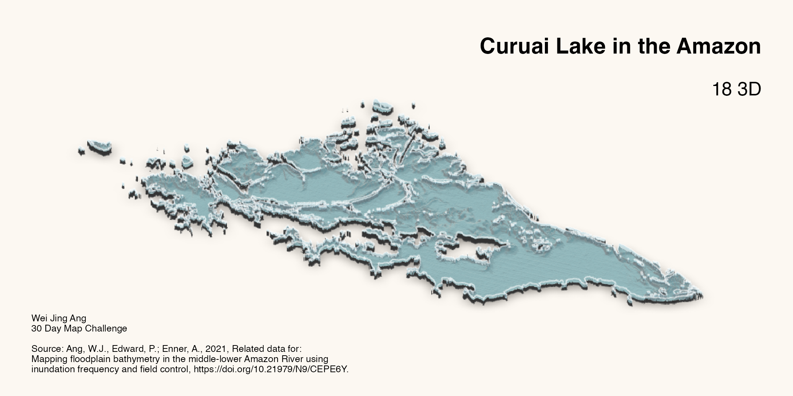
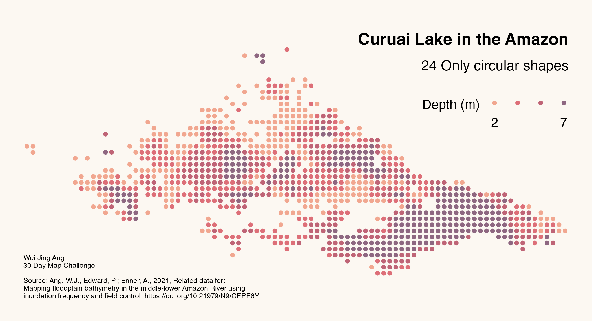
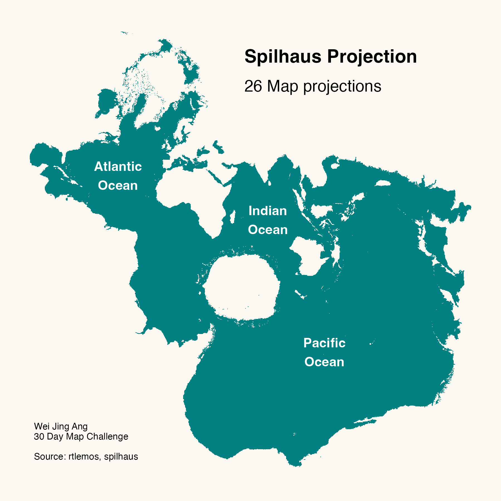

# 30 Day Map Challenge
Entries for the 2024 [30 Day Map Challenge](https://30daymapchallenge.com/), 
created as part of a collaborative project by the 
[MUSA program at UPenn](https://weitzman-musa.github.io/30DayMapChallenge/)!

## Days participated

- Day 1: Points

- Day 2: Lines

- Day 4: Hexagons

- Day 6: Raster

- Day 7: Vintage

- Day 12: Time and space

- Day 16: Choropleth

- Day 18: 3D

- Day 24: Only circular shapes

- Day 26: Map projections

